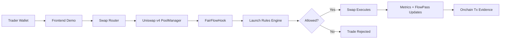

# FairFlow Launch

A Uniswap v4 Hook project on X Layer for fairer launches, anti-sniper launch windows, adaptive LP fees, FlowPass reputation, and verifiable onchain launch evidence.

The product UI uses `FairFlow Launch`. The public submission/repo identity also uses `FairLaunch Hook` through the `xlayer-v4-fairlaunch-hook` repository and X account.

## Build X Submission Snapshot

| Item | Value |
| --- | --- |
| Hackathon Track | Build X - Hook the Future |
| Project | FairFlow Launch / FairLaunch Hook |
| Primary Proof Network | X Layer mainnet, chain ID `196` |
| Secondary Proof Network | X Layer testnet, chain ID `1952`, with self-hosted v4 demo stack |
| Mainnet Status | X Layer mainnet contract stack, proof pool, liquidity, and Hook-triggering swaps deployed |
| PoolManager | [`0x360E68faCcca8cA495c1B759Fd9EEe466db9FB32`](https://www.okx.com/web3/explorer/xlayer/address/0x360E68faCcca8cA495c1B759Fd9EEe466db9FB32) |
| Hook Contract | [`0xc560CD40AcD57db2eD18373351fDcf9211d890C0`](https://www.okx.com/web3/explorer/xlayer/address/0xc560CD40AcD57db2eD18373351fDcf9211d890C0) |
| PoolId | `0x3807e437ed58e8b9047419a93bc1ca9a51455cf0b81cba7a9637e1caba439138` |
| Pool Init Tx | [`0x00a7e164ad3bf5b314b8528fb421abfd28bf8b4de2b552c72beca4c52885da4f`](https://www.okx.com/web3/explorer/xlayer/tx/0x00a7e164ad3bf5b314b8528fb421abfd28bf8b4de2b552c72beca4c52885da4f) |
| Launch Registration Tx | [`0x7f98bd33d6f34a20fdd60faa81dce35a19447bacd949cbf143d227e3a466009e`](https://www.okx.com/web3/explorer/xlayer/tx/0x7f98bd33d6f34a20fdd60faa81dce35a19447bacd949cbf143d227e3a466009e) |
| Liquidity Tx | [`0x97f347fa19980fe9db361e872f5d3806964d22401fad21db6be04b330e6b2aa7`](https://www.okx.com/web3/explorer/xlayer/tx/0x97f347fa19980fe9db361e872f5d3806964d22401fad21db6be04b330e6b2aa7) |
| Swap Tx Triggering Hook | [`0x0edeb154ee7cba0c3bc9125feb1d86c986a248f923d0ce5899b68de42da7f617`](https://www.okx.com/web3/explorer/xlayer/tx/0x0edeb154ee7cba0c3bc9125feb1d86c986a248f923d0ce5899b68de42da7f617) |
| Testnet FlowPass Tier Upgrade Swap | [`0x97782b358bfa0cc9dde75966bf7e27a9bbdd632827b7f942ae099054cbcd0de8`](https://www.okx.com/web3/explorer/xlayer-test/tx/0x97782b358bfa0cc9dde75966bf7e27a9bbdd632827b7f942ae099054cbcd0de8) |
| Frontend Demo | [https://fairflow-launch.pages.dev](https://fairflow-launch.pages.dev) |
| Demo Video | Pending upload; recording plan in [`docs/VIDEO_SCRIPT.md`](docs/VIDEO_SCRIPT.md) |
| X Account | [https://x.com/fairlaunchhook](https://x.com/fairlaunchhook) |
| GitHub | [https://github.com/sinco-lab/xlayer-v4-fairlaunch-hook](https://github.com/sinco-lab/xlayer-v4-fairlaunch-hook) |

## One-Line Description

FairFlow Launch is a Uniswap v4 Hook on X Layer that helps new pools launch more fairly by applying deterministic launch-window guardrails, dynamic fee overrides, FlowPass reputation checks, and onchain proof surfaces.

## Problem

New token launches often face three practical problems:

1. Sniper bots can dominate the first blocks of trading.
2. Launch rules are often opaque, centralized, or enforced offchain.
3. Early community participants have few ways to prove healthy participation or receive transparent incentives.

FairFlow Launch moves the launch policy closer to swap execution by using a Uniswap v4 Hook. The result is easier to inspect: reviewers can check the Hook address, PoolId, pool init transaction, launch registration transaction, and swaps that triggered Hook events.

## Solution

FairFlow Launch adds programmable launch controls around a Uniswap v4 pool:

- launch-window max-buy and cooldown checks
- deterministic dynamic LP fee override
- market-quality scoring from swap flow
- FlowPass soulbound reputation tiers
- FlowPass-aware discounts only when launch guards and market health allow it
- read-only proof/report surfaces for reviewers and users

The Agent/FairFlow Report layer is read-only. It explains already-recorded Hook state and events; it does not control fees, pool parameters, wallet actions, or AMM behavior.

## How It Works



## Hook Logic

`FairFlowHook` focuses on the launch phase of a new pool.

During `beforeSwap`, the Hook:

- decodes the real trader from `hookData`
- checks launch-window max-buy limits and cooldowns
- calculates a deterministic LP fee override
- keeps FlowPass discounts disabled when launch guards or high-risk states should dominate

During `afterSwap`, the Hook:

- updates rolling volume, net flow, buy/sell counts, large-trade counts, and unique trader counts
- recomputes the Market Quality Score
- mints or upgrades FlowPass only when post-launch health gates allow it
- emits proof events such as `FairFlowSwap`, `MarketScoreUpdated`, and `FlowPassUpgraded`

The Hook does not use an external oracle, upgradeable proxy, custom AMM curve, treasury Hook fee, or AI-controlled parameter path.

## Why This Is A Uniswap v4 Hook

Uniswap v4 Hooks allow pool behavior to be customized at lifecycle points such as initialization and swaps. FairFlow Launch uses that mechanism to put fair-launch rules directly around pool execution instead of relying only on offchain moderation, centralized launch rules, or a separate indexer.

## Why X Layer

X Layer provides a low-cost EVM environment for high-frequency onchain trading experiments, launch pools, and DeFi applications. This project uses X Layer testnet for a repeatable browser demo and X Layer mainnet for a verifiable Hook proof on official Uniswap v4 infrastructure.

## Scoring Alignment

### Innovation

FairFlow Launch is not a normal swap pool. It uses Uniswap v4 Hook callbacks to enforce launch-window checks, return adaptive LP fee overrides, emit market-quality signals, and attach FlowPass reputation to trading behavior.

### Market Potential

The project targets new token launches, launchpad pools, community launches, meme/token issuance, and fair-access mechanisms. These use cases can generate trading activity, liquidity, and community engagement on X Layer.

### Completion

Implemented and recorded:

- `FairFlowHook`
- `LaunchFactory`
- `FlowPassNFT`
- `MetricsLens`
- X Layer testnet pool initialization, launch registration, liquidity, and swaps that trigger Hook events
- X Layer mainnet contract deployment on official Uniswap v4 infrastructure
- X Layer mainnet pool initialization, launch registration, bounded liquidity, and Hook-triggering swaps
- frontend proof surface and guarded swap UX
- deployment and demo scripts

Still pending:

- uploaded 1-3 minute demo video
- external audit or production security review

### Demo Video Bonus

The suggested video flow is documented in [`docs/VIDEO_SCRIPT.md`](docs/VIDEO_SCRIPT.md). The intended video should show the frontend, Hook mechanism, explorer evidence, PoolId, Hook address, and at least one swap transaction that triggers the Hook.

## X Layer Testnet Evidence

Current proof stack used by the frontend testnet config:

| Contract / Object | Address / ID |
| --- | --- |
| Network | `X Layer testnet` |
| Chain ID | `1952` |
| PoolManager | [`0xF0B851d2C292d4Bae654De7D8A53C7fA6DAc6Ec0`](https://www.okx.com/web3/explorer/xlayer-test/address/0xF0B851d2C292d4Bae654De7D8A53C7fA6DAc6Ec0) |
| PositionManager | [`0xdD821831A0002447c5FcA329E898a286B99FD6f9`](https://www.okx.com/web3/explorer/xlayer-test/address/0xdD821831A0002447c5FcA329E898a286B99FD6f9) |
| SwapRouter | [`0x16B3c4629FB0D61BaD533f6442ac96fE35Db76e0`](https://www.okx.com/web3/explorer/xlayer-test/address/0x16B3c4629FB0D61BaD533f6442ac96fE35Db76e0) |
| FairFlowHook | [`0x8430574aeee6537F0C9699ec643BF58295Fcd0c0`](https://www.okx.com/web3/explorer/xlayer-test/address/0x8430574aeee6537F0C9699ec643BF58295Fcd0c0) |
| LaunchFactory | [`0x8dAd7176C3E6D24Bf642D887Edb53134C62D996b`](https://www.okx.com/web3/explorer/xlayer-test/address/0x8dAd7176C3E6D24Bf642D887Edb53134C62D996b) |
| MetricsLens | [`0x2E6A12A581E2c664dBE51e6cacAf8d80075C2454`](https://www.okx.com/web3/explorer/xlayer-test/address/0x2E6A12A581E2c664dBE51e6cacAf8d80075C2454) |
| FlowPassNFT | [`0x879582E67003a2F330E9A323afCFc3De592B18d2`](https://www.okx.com/web3/explorer/xlayer-test/address/0x879582E67003a2F330E9A323afCFc3De592B18d2) |
| V4Quoter | [`0xD1f05e4654321F49A26015678b8fd8795775d10A`](https://www.okx.com/web3/explorer/xlayer-test/address/0xD1f05e4654321F49A26015678b8fd8795775d10A) |
| Launch Token | [`0x29D2826B97Ec912a54761D0E34E6baF13689f997`](https://www.okx.com/web3/explorer/xlayer-test/address/0x29D2826B97Ec912a54761D0E34E6baF13689f997) |
| Quote Token | [`0x065E67cd83Db2F1E07FA9BE9B68A814Fbe5C4cE6`](https://www.okx.com/web3/explorer/xlayer-test/address/0x065E67cd83Db2F1E07FA9BE9B68A814Fbe5C4cE6) |
| PoolId | `0xb45ba6fc1f31382c0fd1711db9eb81d549a81160936bb3b8fbd575772aaf40cf` |

Proof transactions:

| Proof | Transaction |
| --- | --- |
| Pool initialized through `PoolManager.initialize` | [`0xc4426808752d3d38f7551dd51ed80cf6e8134e18be3686b06e2936710add5f05`](https://www.okx.com/web3/explorer/xlayer-test/tx/0xc4426808752d3d38f7551dd51ed80cf6e8134e18be3686b06e2936710add5f05) |
| Non-owner creator registered launch through public `LaunchFactory` mode | [`0x81b6a661c0ce430ed9ef58c2e96041fc92f0d7254df3c34a0a52ac2830b0b7bf`](https://www.okx.com/web3/explorer/xlayer-test/tx/0x81b6a661c0ce430ed9ef58c2e96041fc92f0d7254df3c34a0a52ac2830b0b7bf) |
| Full-range demo liquidity added | [`0xc6ba970e17f703f37f824fd68b9c77f4b549e018c06c87842e2f484c160d82a1`](https://www.okx.com/web3/explorer/xlayer-test/tx/0xc6ba970e17f703f37f824fd68b9c77f4b549e018c06c87842e2f484c160d82a1) |
| Swap triggering Hook events and FlowPass mint path | [`0x4c336046a7f79ca4161096d322b67f60b63bc891acdcf4a6556c04ebcf4795ef`](https://www.okx.com/web3/explorer/xlayer-test/tx/0x4c336046a7f79ca4161096d322b67f60b63bc891acdcf4a6556c04ebcf4795ef) |
| Swap triggering Hook events and FlowPass Tier 2 upgrade path | [`0x97782b358bfa0cc9dde75966bf7e27a9bbdd632827b7f942ae099054cbcd0de8`](https://www.okx.com/web3/explorer/xlayer-test/tx/0x97782b358bfa0cc9dde75966bf7e27a9bbdd632827b7f942ae099054cbcd0de8) |

The testnet proof uses a self-hosted Uniswap v4 core/periphery stack because official X Layer testnet v4 deployments were not listed when the demo was prepared. This is intentionally labeled as demo infrastructure, not as an official Uniswap deployment.

## X Layer Mainnet Proof

The project contract stack, proof pool, liquidity, and demo swaps are deployed on X Layer mainnet.

| Contract / Object | Address / ID |
| --- | --- |
| Network | `X Layer mainnet` |
| Chain ID | `196` |
| Official PoolManager | [`0x360E68faCcca8cA495c1B759Fd9EEe466db9FB32`](https://www.okx.com/web3/explorer/xlayer/address/0x360E68faCcca8cA495c1B759Fd9EEe466db9FB32) |
| Official PositionManager | [`0xcF1EAFC6928dC385A342E7C6491d371d2871458b`](https://www.okx.com/web3/explorer/xlayer/address/0xcF1EAFC6928dC385A342E7C6491d371d2871458b) |
| Official Universal Router | [`0xDa00aE15d3A71466517129255255db7c0c0956d3`](https://www.okx.com/web3/explorer/xlayer/address/0xDa00aE15d3A71466517129255255db7c0c0956d3) |
| Mainnet FairFlowHook | [`0xc560CD40AcD57db2eD18373351fDcf9211d890C0`](https://www.okx.com/web3/explorer/xlayer/address/0xc560CD40AcD57db2eD18373351fDcf9211d890C0) |
| Mainnet FlowPassNFT | [`0xCb51e38BEA371644BbafDE9e4972301c610fb8e7`](https://www.okx.com/web3/explorer/xlayer/address/0xCb51e38BEA371644BbafDE9e4972301c610fb8e7) |
| Mainnet LaunchFactory | [`0xe2e1a6AD6D596Cd88b27C82173eD9099609eE869`](https://www.okx.com/web3/explorer/xlayer/address/0xe2e1a6AD6D596Cd88b27C82173eD9099609eE869) |
| Mainnet MetricsLens | [`0x8683aD69A2DbEaFb4B361f7A13B714002466C613`](https://www.okx.com/web3/explorer/xlayer/address/0x8683aD69A2DbEaFb4B361f7A13B714002466C613) |
| Launch Token | [`0x9Aa9313467F791f5AC031F5f130cA07F23e25204`](https://www.okx.com/web3/explorer/xlayer/address/0x9Aa9313467F791f5AC031F5f130cA07F23e25204) |
| Quote Token | [`0xd641ed64bbe3dB2856E6523a2968D33Ff5e55d22`](https://www.okx.com/web3/explorer/xlayer/address/0xd641ed64bbe3dB2856E6523a2968D33Ff5e55d22) |
| PoolId | `0x3807e437ed58e8b9047419a93bc1ca9a51455cf0b81cba7a9637e1caba439138` |
| Pool Init Tx | [`0x00a7e164ad3bf5b314b8528fb421abfd28bf8b4de2b552c72beca4c52885da4f`](https://www.okx.com/web3/explorer/xlayer/tx/0x00a7e164ad3bf5b314b8528fb421abfd28bf8b4de2b552c72beca4c52885da4f) |
| Launch Registration Tx | [`0x7f98bd33d6f34a20fdd60faa81dce35a19447bacd949cbf143d227e3a466009e`](https://www.okx.com/web3/explorer/xlayer/tx/0x7f98bd33d6f34a20fdd60faa81dce35a19447bacd949cbf143d227e3a466009e) |
| Liquidity Tx | [`0x97f347fa19980fe9db361e872f5d3806964d22401fad21db6be04b330e6b2aa7`](https://www.okx.com/web3/explorer/xlayer/tx/0x97f347fa19980fe9db361e872f5d3806964d22401fad21db6be04b330e6b2aa7) |
| Hook Event Swap Tx | [`0x0edeb154ee7cba0c3bc9125feb1d86c986a248f923d0ce5899b68de42da7f617`](https://www.okx.com/web3/explorer/xlayer/tx/0x0edeb154ee7cba0c3bc9125feb1d86c986a248f923d0ce5899b68de42da7f617) |
| Latest Score Update Swap Tx | [`0x469907b259ecaaed8f46f8a1d8599cccff49a2fe212808acd5c801951d538a06`](https://www.okx.com/web3/explorer/xlayer/tx/0x469907b259ecaaed8f46f8a1d8599cccff49a2fe212808acd5c801951d538a06) |

See [`docs/ADDRESSES.md`](docs/ADDRESSES.md) and [`docs/MAINNET_READINESS.md`](docs/MAINNET_READINESS.md) for the deployment record and production gate.

## Run Locally

Install JavaScript dependencies:

```bash
pnpm install
```

Run the frontend against the recorded X Layer testnet proof config:

```bash
cp frontend/.env.xlayer-testnet.example frontend/.env.local
pnpm dev
```

Open the Vite URL printed by the command, usually `http://127.0.0.1:5173`.

## Contracts

Install Foundry dependencies if they are not already present:

```bash
cd contracts
forge install
```

Build and test:

```bash
cd contracts
forge fmt --check
forge build
forge test -vvv
```

Local demo scripts:

```bash
cd contracts
forge script script/DeployLocal.s.sol
forge script script/CreateDemoPool.s.sol
forge script script/DemoSwaps.s.sol
```

X Layer testnet shared-stack proof script:

```bash
cd contracts
forge script script/DeployXLayerTestnetPhase20.s.sol --rpc-url "$XLAYER_TESTNET_RPC_URL"
forge script script/DeployXLayerTestnetPhase20.s.sol --rpc-url "$XLAYER_TESTNET_RPC_URL" --broadcast
```

Use the first command as a simulation. Broadcast only after deployer address, gas budget, self-hosted stack addresses, token addresses, and spending limits are confirmed.

X Layer mainnet dry-run:

```bash
cd contracts
cp .env.xlayer-mainnet.example .env
forge script script/DeployXLayer.s.sol --rpc-url "$XLAYER_RPC_URL"
```

Do not add `--broadcast` unless the target network, chain ID, official Uniswap v4 addresses, deployer address, gas balance, and spending limits have been manually confirmed.

## Frontend Checks

```bash
pnpm lint
pnpm build
```

Enable live browser writes only for intentional testnet sessions:

```bash
VITE_PULSEPOOL_ENABLE_WRITES=true
```

The public mainnet build can enable the configured proof-pool swap path with `VITE_PULSEPOOL_ENABLE_SWAP_WRITES=true` while keeping broader launch creation paused with `VITE_PULSEPOOL_ENABLE_CREATE_WRITES=false`.

## Repository Structure

```text
contracts/   Hook contracts, Foundry tests, and deployment scripts
frontend/    Vite/React demo, proof dashboard, guarded swap UX, and reports
docs/        Architecture, addresses, judging notes, test plan, and video script
recordings/  Local video output folder, not intended for committed public artifacts
```

## Demo Flow

1. Open the frontend demo.
2. Select the recorded X Layer testnet proof pool.
3. Review PoolManager, Hook address, PoolId, tokens, and proof transactions.
4. Connect a wallet on X Layer testnet if running a live testnet write session.
5. Submit a small swap through the guarded Fair Swap surface.
6. Confirm the receipt contains a `FairFlowHook` log.
7. Open the transaction in the OKX X Layer explorer.
8. Refresh Launch Proof and FairFlow Report to inspect Hook state, events, and FlowPass status.

## Security Notes

This is a hackathon prototype. It is not audited and should not be used with real user funds without further testing, review, monitoring, and security hardening.

Known limitations:

- X Layer testnet evidence uses a self-hosted demo v4 stack.
- Mainnet proof pool is initialized with bounded demo liquidity and Hook-triggering swap receipts.
- Fee and market-score formulas are MVP heuristics, not economic guarantees.
- FlowPass is a reputation proof, not a guarantee of fair trading outcomes.
- The frontend is a demo and verification surface; write paths are intentionally guarded.
- No AI or offchain agent controls Hook state, fees, launch rules, or AMM parameters.
- Do not commit `.env`, private keys, mnemonics, RPC secrets, or API keys.

## Links

- Frontend Demo: [https://fairflow-launch.pages.dev](https://fairflow-launch.pages.dev)
- X Account: [https://x.com/fairlaunchhook](https://x.com/fairlaunchhook)
- GitHub: [https://github.com/sinco-lab/xlayer-v4-fairlaunch-hook](https://github.com/sinco-lab/xlayer-v4-fairlaunch-hook)
- Build X Hackathon Page: [https://web3.okx.com/ro/xlayer/build-x-hackathon/hook](https://web3.okx.com/ro/xlayer/build-x-hackathon/hook)
- Address Record: [`docs/ADDRESSES.md`](docs/ADDRESSES.md)
- Video Script: [`docs/VIDEO_SCRIPT.md`](docs/VIDEO_SCRIPT.md)
- Security Notes: [`docs/SECURITY_NOTES.md`](docs/SECURITY_NOTES.md)
